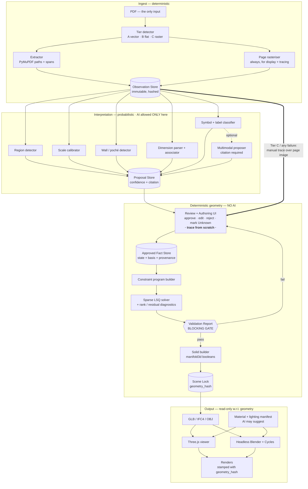

# Development Plan: PDF Floor Plans → Deterministic Dimensioned 3D Model → Unlimited Renders

> **Status:** approved plan · revised 2026-08-18 · no implementation started
> **Fixture:** Garrigan, 261 Grove Street, Montclair NJ — *Design Options Set 08.13.26* (sheets A-0…A-3, A-3 OP#B)
> **Scope of this document:** architecture and roadmap only. No production code.

## Context

A previous generative render of the attached first-floor plan produced a plausible but **topologically wrong** family room: it moved the mudroom opening and mounted the 60" television over the 5'-0" cased opening into the original living room. That failure is not a prompt problem — it is an architecture problem. An image model has no persistent representation of "which wall," so it cannot be made reliably right.

This plan specifies a system where that class of error is **structurally impossible after validation**: probabilistic interpretation is confined to a proposal layer, a deterministic constraint-based geometry engine builds the model, and every camera renders the same hashed scene.

**What I did before planning.** I rendered and read every page of both PDFs at high resolution *and* probed their vector structure programmatically. Findings materially changed the recommended staging (§14) and de-risked the core feasibility question (§2). The evidence is in Appendix A — read it, because several conclusions in this plan depend on it and several of them contradict the assumptions in the brief.

**Decisions already taken** (recorded here so they are not relitigated):
- *Input format:* **PDF is the product's input. Full stop.** Not DWG, not DXF, not IFC, not a BIM export. The tool must work from the document a homeowner or contractor actually has in hand, and it may not assume cooperation from whoever authored the drawings. Every fallback in this plan therefore resolves to the product's own tools, never to a better source file.
- *Platform:* local-first hybrid — Python geometry/extraction core plus a TypeScript/Three.js browser UI over localhost, packageable as a desktop app later. Drawings never leave the machine without an explicit per-project opt-in.
- *This milestone:* architecture and roadmap only; implementation begins at Sprint 1 (§20).

---

## 1. Executive recommendation

Build **a provenance-carrying, human-validated vector-plan reconstructor**, not a plan-to-render AI. Three commitments define it:

1. **A one-way valve.** Data flows `Observation → Proposal → Approved Fact → Constraint Program → Solved Geometry → Scene Lock → Renders`. Nothing downstream of Scene Lock may write geometry. AI writes only into `Proposal`.
2. **A custom architectural scene graph is the canonical model, not IFC.** IFC has no native representation for *unknown*, *inferred*, *confidence*, or *provenance back to PDF path #4711*. Those are the whole point. IFC4 is an **export target** via IfcOpenShell.
3. **Integer nanometres are the unit of record.** 1 in = 25,400,000 nm exactly and 1/64 in = 396,875 nm exactly, so imperial architectural fractions are represented without float drift, and metric input is equally exact. Feet-and-inches is a display format, never a storage format.

**Primary MVP stack**

| Layer | Choice | Why this is the lowest-risk path |
|---|---|---|
| PDF vector extraction | **PyMuPDF** (`get_drawings`, `get_text("dict")`) | Only mainstream library that returns per-path fill colour, stroke colour, width, and geometry together. This fixture encodes *all* of its semantics in fill/stroke colour (Appendix A). ⚠️ AGPL-3.0 — see §18 R5. |
| 2D geometry | **shapely 2.x** + **networkx** | Polygonisation, arrangement, wall-graph topology. BSD. |
| Constraint solving | **SciPy sparse linear least-squares with hard equality constraints + rank/nullspace diagnostics** | Residential plans are ~95% axis-aligned, so dimension constraints are 1D affine per axis. A linear system gives *free* detection of over-/under-/contradictory constraints via rank deficiency and residual analysis — exactly what the brief demands. A general nonlinear GCS does not give this cleanly. |
| Non-orthogonal escape hatch | **planegcs** (FreeCAD's 2D solver, WASM/LGPL) | Only invoked for angled/curved walls (this house has a curved bay). Not on the MVP critical path. |
| Solid geometry | **manifold3d** (Apache-2.0) | Deterministic, guaranteed-manifold mesh booleans — wall/opening subtraction, roof clipping. Deterministic output is a stated project requirement; OpenCASCADE is heavier and harder to pin. |
| Canonical store | **SQLite single-file project (`.g3d`)** + JSON-Schema-validated documents | Local, versionable, hashable, no server. |
| Interactive render | **Three.js** (WebGL2 baseline; WebGPU opportunistically) | Review UI and navigable 3D. |
| Photoreal render | **Headless Blender + Cycles**, driven by a generated script that imports the exported GLB | Physically-based, deterministic given pinned version + seed, free, local. |
| Export | **glTF/GLB** (primary), **IFC4** via IfcOpenShell, **OBJ** | |
| Review UI | React + TypeScript + Three.js + pdf.js underlay | |
| AI proposals (Stage 2+) | Claude multimodal API, or a local VLM in strict-privacy mode | Proposer only. Every proposal must carry a citation and snap to extracted geometry. |

**The single most important consequence of PDF-only input:** the product has no escape hatch, so **the manual authoring surface is the product's floor, not its fallback.** Every hard extraction problem in this document — dense dimension chains, curved walls, unreadable scans, roof planes — resolves to the same place: a user calibrating scale and drawing the element by hand, with snapping and exact feet-and-inches, over the page image. That surface must therefore be genuinely good in Stage 0, before any automation exists, because it is the thing that guarantees the product always works. Automation then reduces how often the user touches it; it never becomes a precondition for the product functioning.

**Capability tiers, declared at import.** A PDF is not one input format, it is three, and the product must say which one it is looking at and what that costs the user:

| Tier | What it is | What the product does | Expected human effort |
|---|---|---|---|
| **A** | Native vector with structured semantics — colour-coded poché, live text, plotted from a BIM/CAD tool. *The Garrigan set is Tier A.* | Full automatic extraction; user reviews and approves | Minutes per floor |
| **B** | Native vector, flat semantics — geometry present but no colour/layer coding, text exploded to outlines, or an unfamiliar office convention | Automatic geometry, manual semantics: user assigns wall phases, confirms openings | Tens of minutes per floor |
| **C** | Raster — scanned, photographed, or image-only export. No vector geometry to recover | Calibrate + trace over the page image with snapping; automated proposals arrive in Stage 3 | Roughly an hour per floor |

Tier is detected on import (path count, text-span count, image coverage) and shown to the user with an honest effort estimate *before* they invest time. **All three tiers are usable from Stage 0**, because all three bottom out in the same manual authoring surface. This is the "fail informatively" principle applied at the front door: the product never silently does a bad job on a scan, and it never refuses one either.

---

## 2. What is and is not technically feasible

### Feasible, and I verified it on this fixture

- **Sub-inch dimension recovery from native vector PDFs.** A ~30-line heuristic matcher, correcting for a single constant dimension-line overshoot, matched **141 of 143** dimension strings across all four sheets with **median error 0.06–0.38 inches** and 65–100% of dimensions under 1 inch. With proper tick-glyph detection instead of line endpoints this becomes essentially exact. *Dimension recovery on this class of drawing is a deterministic parsing problem, not an AI problem.*
- **Scale establishment without trusting the title block.** The kitchen island poché measures 154.67 × 77.22 pt against a label of 8'-7" × 4'-3", implying 0.6659 and 0.6604 in/pt versus the theoretical 0.66667 for 1/4"=1'-0" — errors of 0.1% and 0.9%. Scale is recoverable from the drawing itself and cross-checkable against the note.
- **Existing / new / demolished separation, deterministically.** This set encodes it in fill and stroke colour: `0.851` grey fill = existing wall poché, `0.298` dark fill = new wall poché, pure red stroke = demolition. No AI required.
- **Wall face coordinates and thickness directly from poché polygons.** Wall rectangles come out with exact face coordinates; e.g. the mudroom's new north wall is 9.01 pt thick = 6.0 in exactly.
- **Ordered wall-opening topology as an enforceable invariant.** See §8. This is the fix for the stated failure.
- **Vertical dimension chains from sections.** The attic section carries a clean 8'-0" / 1'-0" / 7'-10" / 6'-8" / 0'-10" chain readable by the same algorithm as plan dimensions.
- **Identical geometry across unlimited cameras.** Trivially guaranteed once geometry is hashed and the renderer is read-only.

### Feasible with effort

- Drawing-region detection on multi-plan sheets (this set has 2–3 regions per sheet plus title block, legends, photos, and 3D thumbnails to reject).
- Design-option handling. **Required, not optional** — sheet A-2 carries a third region, "Proposed - Second floor OP#B", and the attic PDF is an entire alternate option set (`A-3 OP#B`).
- Multistory vertical registration by 2-point corner/chimney matching.
- Stair reconstruction from riser/tread notes ("3 RISERS / 7" / 2 TREADS / 12"").
- Roof-plane reconstruction from pitch annotations plus section cuts — **highest-risk item in the project** (§18 R1).

### Not feasible — stated plainly

- **Unattended conversion of arbitrary architectural sets.** No. Human confirmation is a permanent architectural feature, not a temporary crutch.
- **Construction-grade output.** This produces a *design-communication* model. Where a wall is not explicitly dimensioned, it is measured off linework: a 0.5 pt line at 1/4" scale is ~0.33 in real-world, so un-dimensioned geometry carries a **±1/2 in** honest band and can never be marked construction-grade.
- **Automatic geometry from raster scans.** A vision model can propose a wall; it cannot guarantee one. Scans are fully *supported* — the user calibrates and traces them, and the resulting model is exactly as trustworthy as any other, because it went through the same constraint solve and validation. What is not feasible is doing it *for* them without review, and the UI will say so.
- **Any input format other than PDF.** Not a technical limit — a product decision (§1). DWG, DXF and IFC ingest are permanently out of scope.
- **Framing, structure, MEP, or code compliance.** Out of scope, permanently.
- **Direct `.rvt` read/write.** No open format exists; only IFC interchange or the Windows Revit API. Out of scope.
- **Hand-drawn or redlined markup.** Out of scope.
- **Any guarantee from a generative image model.** Named explicitly so it is never revisited: image-to-image models may be used for *material and decor suggestion only*, downstream of Scene Lock, and their output can never re-enter the geometry pipeline.

---

## 3. Proposed user workflow

1. **Import** PDF. Pages are rasterised for display and parsed for vectors. The document's **capability tier** (§1) is detected and shown with an honest effort estimate before the user commits time.
2. **Region detection.** System proposes drawing regions per sheet with detected titles ("Proposed - First Floor", "1/4" = 1'-0""). User confirms, merges, or deletes. Photos, 3D thumbnails, legends, and title blocks are auto-rejected and shown as rejected.
3. **Role assignment.** For each region, user assigns: `discipline=plan|section|elevation|axon`, `level`, `variant = existing | proposed | option:<name>`. **The system never guesses which option is "the" proposal.**
4. **Calibration.** System proposes scale from (a) title-block note, (b) regression over matched dimension strings, (c) graphic scale bar if present. It shows all three and their disagreement. User picks or draws a calibration dimension.
5. **Extraction.** Walls (existing/new/demo separated), openings, doors, windows, stairs, fixtures, casework, furniture, room labels, dimension strings, ceiling-height tags.
6. **Dimension association.** Each dimension is bound to the two geometric features it controls. Unassociated dimensions are surfaced as a work queue, never silently dropped.
7. **Review overlay.** Extracted geometry drawn over the source page, colour-coded by state (`observed / inferred / proposed / confirmed`). User approves, moves, resizes, relabels, deletes, adds. Every edit is recorded with its own provenance (`user_authored`).
8. **Vertical assembly.** Floors registered to each other; levels, floor assemblies, and ceiling heights set from plan tags and section chains. Anything unresolved stays `Unknown`.
9. **Validation report.** Generated *before* any 3D is built. Blocking errors, warnings, and an explicit unknowns inventory.
10. **Build + Lock.** Deterministic geometry construction; a `scene.lock.json` with a geometry hash is emitted.
11. **Cameras & renders.** Unlimited cameras; navigable Three.js view; batch Cycles renders. Every output stamped with the geometry hash.
12. **Exact editing.** Any dimension editable in feet-and-inches; edits re-enter at step 7 and force re-validation and a new hash.
13. **Inspect provenance.** Click any wall/opening → source sheet, page, region, the specific paths and dimension strings that produced it, and which interpretation step created it.

---

## 4. System architecture



**The enforcement mechanism.** `geometry_hash` is computed over the canonical serialisation of solved geometry immediately after Build. The render workers re-compute it on load and abort on mismatch. The Blender driver script is generated, contains no mesh-editing calls, and is itself hashed and checked into the regression fixtures. Material assignment operates on a name-keyed manifest that cannot address vertices.

---

## 5. Canonical data model

### 5.1 Units, coordinates, levels

- **Unit:** `int64` nanometres. Helpers `ft_in(s) -> nm` and `nm_to_ft_in(n) -> str`. Angles: millidegrees (`int32`).
- **Coordinate frames:**
  - `SheetCS` — PDF user-space points, per page, y-down, as reported by the extractor.
  - `RegionCS` — per drawing region: real-world 2D nm. Transform from SheetCS is `scale · R(0|90|180|270) · translate`, stored explicitly with its calibration residual.
  - `ProjectCS` — right-handed, **+Z up**, +X = project east, nm. Region→Project alignment stored as a 2-point registration with RMS error.
- **Levels:** a `Level` owns a datum elevation (finished floor). This project needs *sub-levels*: the basement has two floor planes separated by three 7" risers.

### 5.2 Entity schemas (abbreviated; JSON Schema files ship with the plan)

```jsonc
// Universal provenance — attached to every entity
SourceRef {
  doc_id: str, page: int, region_id: str|null,
  kind: "path" | "span" | "image" | "user",
  path_uids: [str],          // sha1(page_idx, draw_idx, quantised_pts) — stable per extractor_version
  bbox_sheet: [f,f,f,f],
  extractor_version: str
}

// Universal epistemic state — attached to every entity
Provenance {
  state: "OBSERVED" | "INFERRED" | "PROPOSED" | "USER_CONFIRMED" | "USER_AUTHORED" | "REJECTED",
  basis: "explicit_dimension" | "measured_from_geometry" | "inherited_from_level"
       | "read_from_section" | "assumed_default" | "unknown",
  confidence: f|null,        // null iff state is USER_*
  tolerance_nm: int,         // honest band: 25_400_000 (1") for dimensioned, 12_700_000 (1/2") measured
  source_refs: [SourceRef],
  created_by: str            // "extractor@1.2.0" | "vlm-proposer@..." | "user:<id>"
}

Project { id, name, address, project_cs, levels: [Level], docs: [SourceDocument], variant_active: str }
SourceDocument { id, filename, sha256, page_count, is_vector: bool }
Sheet { doc_id, page_index, size_pt, title_block: {sheet_no, scale_note, date, revision} }
DrawingRegion {
  id, sheet, bbox_sheet, title, scale_note,
  discipline: "plan"|"section"|"elevation"|"axonometric"|"detail",
  level_id, variant: "existing"|"proposed"|"option:<name>"|"demolition",
  calibration: { in_per_pt: f, rotation_mdeg: int, residual_pct: f, method: "regression"|"note"|"user"|"scalebar" },
  prov: Provenance
}

Level {
  id, name, elevation_nm: int|UNKNOWN, floor_assembly_nm: int|UNKNOWN,
  default_ceiling_nm: int|UNKNOWN, parent_level_id|null,   // for basement sub-levels
  prov
}

WallSegment {
  id, level_id, variant,
  baseline: { p0:[nm,nm], p1:[nm,nm] },     // centreline in ProjectCS
  thickness_nm: int, offset_nm: int,        // offset of solid from baseline (0 = centred)
  base_z_nm: int|INHERIT, top_z_nm: int|INHERIT|UNKNOWN,
  construction: "existing"|"new_2x_16oc_gwb_both"|"cmu"|"demolished",
  openings: [Opening],                      // ORDERED, see invariant below
  prov
}

Opening {                                   // parametric ALONG the wall — this is the whole fix
  id, kind: "door"|"window"|"unframed"|"cased"|"pass_through"|"niche",
  t_start_nm: int, t_end_nm: int,           // distance from baseline.p0 along the wall
  sill_nm: int|UNKNOWN, head_nm: int|UNKNOWN,
  swing: {hinge:"start"|"end", direction:"in"|"out", angle_mdeg}|null,
  connects: [room_id, room_id|"EXTERIOR"],
  annotation: str|null,                     // e.g. "60\" TV" is NOT an opening — see §16
  prov
}

Room { id, level_id, name, boundary: [wall_edge_ref], ceiling_id|null, floor_id|null, area_nm2, prov }
Stair { id, from_level, to_level, riser_count, riser_nm, tread_nm, run_path:[pt], width_nm, landings:[Landing], prov }
FloorSlab { id, level_id, boundary_polygon, thickness_nm, prov }
CeilingPlane { id, level_id, boundary_polygon, z_nm|UNKNOWN, slope_mdeg|0, prov }
RoofPlane { id, boundary_polygon_3d, pitch_rise_per_12_nm, eave_z_nm, ridge_z_nm, thickness_nm, prov }
Dormer { id, roof_plane_id, kind:"shed"|"gable", footprint, head_z_nm, prov }
FixedCabinetry { id, level_id, footprint, height_nm, kind:"base"|"upper"|"tall"|"island", label, prov }
PlumbingFixture { id, level_id, kind, footprint, transform, prov }
Furniture { id, ..., is_advisory: true }   // never load-bearing for validation

DimensionConstraint {
  id, region_id, text: str, value_nm: int,
  axis: "x"|"y"|"along:<wall_id>"|"z",
  feature_a: FeatureRef, feature_b: FeatureRef,   // wall face, opening jamb, grid, region datum
  chain_id: str|null, is_overall: bool,
  weight: f,                                       // 1.0 explicit; lower for inferred
  prov
}
AlignmentConstraint { id, kind:"collinear"|"equal"|"perpendicular"|"vertical_align", members:[FeatureRef], prov }
// "EQ" tags on sheet A-3 map to AlignmentConstraint(kind="equal") — NOT to a numeric value.

Material { id, name, pbr:{base_color, roughness, metallic, normal_tex, scale_nm}, assigned_to:[selector], is_advisory:true }
Camera { id, name, position, target, fov_deg, sensor, clip, level_hint, geometry_hash_at_creation }
SceneLock { geometry_hash: sha256, built_at, builder_version, entity_count, validation_report_id }
```

### 5.3 The topology invariant

```
For every WallSegment W:
  openings sorted ascending by t_start
  ∀i: 0 ≤ o[i].t_start < o[i].t_end ≤ |W.baseline|
  ∀i: o[i].t_end ≤ o[i+1].t_start          # non-overlapping
```

An `Opening` **cannot exist without a wall**, and it cannot be re-ordered by anything downstream. The "60" TV" annotation attaches to a *wall interval*, not to an opening — so a TV can only ever be placed on solid wall. The reported failure mode becomes unrepresentable.

### 5.4 How a proposal becomes deterministic geometry

```
Observation  (path #4711: dark-grey filled polygon, 4 verts, sheet A-1)
   │  extractor@1.2.0 — deterministic, no AI
   ▼
Proposal     (WallSegment, construction="new_...", confidence 0.94, cites path #4711)
   │  ← this is the ONLY place an AI may write
   ▼
Approved Fact (state=USER_CONFIRMED, basis=explicit_dimension, tolerance 1")
   │  user clicked "confirm" in the overlay, or auto-approved above threshold per policy
   ▼
Constraint Program (variables = wall face x/y coords; equations = DimensionConstraints)
   │  rank check → over/under/contradiction diagnosis
   ▼
Solved Geometry (exact int64 nm coordinates; solver is pure, seeded, reproducible)
   │
   ▼
Scene Lock (sha256) → renders
```

Auto-approval policy is configurable and starts **off**. Nothing becomes construction-grade because a model produced it.

---

## 6. PDF / vector extraction pipeline

1. **Document triage.** Vector vs raster per page (path count + text-span count thresholds). Both fixture documents are fully vector; embedded raster images are photos and 3D thumbnails to be *excluded* from geometry.
2. **Path harvest.** For every path: type (`stroke`/`fill`), stroke colour, fill colour, width, dash array, and flattened segments. Assign `path_uid = sha1(page_idx, draw_idx, quantised_points)`.
3. **Semantic colour map — learned per document set, not hardcoded.** The legend on each sheet ("EXISTING WALL", "NEW 2x WOOD FRAME…", "EXISTING WALL TO BE DEMOLISHED") is itself parsed: locate the legend swatches, read their fill/stroke, and bind them to the taxonomy. This makes the system portable to other architects' conventions and is the single highest-leverage generalisation trick in the pipeline.
4. **Dashed-line reconstruction.** This set uses **no PDF dash arrays** — everything is `[] 0`. Demolition dashes are drawn as physically separate ~4–6 inch (real-world) segments. Detection is by colour + collinearity + gap-regularity clustering, never by dash array.
5. **Text harvest.** Spans with bbox, size, font, colour, and direction. Reassemble split spans (`"CLG HT - 8'"` + `" 5\""`) by baseline + gap.
6. **Text classification** into: `dimension_string`, `ceiling_height_tag`, `room_label`, `appliance_label`, `note`, `title`, `scale_note`, `sheet_number`, `revision`, `pitch_annotation`, `equality_tag`, `keynote`. Colour and size are strong features here: blue = new/overall dimensions and CLG HT tags, grey = existing labels. **`"CLG HT - 8' 5\""` parses as a dimension under a naive regex — the classifier must exclude it, and the regression suite asserts this.**
7. **White-mask suppression.** Pure-white filled rectangles are text backgrounds behind dimension strings; they must be dropped before poché detection or they will be read as walls.
8. **Region segmentation.** Cluster geometry+text spatially; anchor each cluster on its title bubble ("2 / Proposed - First Floor. / 1/4" = 1'-0""). Reject title block, legends, notes, images.
9. **Calibration.** Regress labelled dimension values against measured tick spans within a region; report `in_per_pt`, residual %, and disagreement with the title-block note.
10. **Poché → wall centrelines.** Filled wall polygons → medial axis (straight-skeleton for rectilinear, fallback shapely) → merged, snapped, colinearised centreline graph with per-segment thickness. Junction cleanup: T, L, and X joins resolved to shared nodes.
11. **Opening detection.** Gaps in the wall poché run, plus door-swing arcs and window mullion glyphs, plus the jamb jog pattern. Each becomes a parametric `Opening` on its host wall.
12. **Dimension association.** Detect tick glyphs (short diagonal slash groups) → chain segmentation → bind each dimension text to its two witness features. **Critical: bind to tick positions, not dimension-line endpoints** — line endpoints overshoot ticks by a constant (~3 in real-world per end in this set), which is exactly the error that dropped my naive matcher from ~99% to 12%.

---

## 7. AI interpretation pipeline

**Governing rule:** AI produces `Proposal` records only. Every proposal must carry (a) a citation to specific `path_uid`s or a page bbox, (b) a confidence, and (c) a snap target — proposals that cannot be snapped to extracted vector geometry within tolerance are auto-rejected as hallucinations before a human ever sees them.

| Task | Method | Stage |
|---|---|---|
| Region detection | CV clustering + title-bubble anchoring; VLM only as tie-breaker | 1 |
| Wall/opening detection (vector) | Deterministic (colour + poché + gaps) | 1 |
| Text classification | Rules + colour/size features; small classifier if needed | 1 |
| Dimension association | Deterministic tick/chain geometry | 1 |
| Symbol recognition (fixtures, appliances, stairs, door types) | Template + CV matching; VLM proposer for the tail | 2 |
| OCR for raster sheets | Local OCR engine; VLM for layout | 2 |
| Section↔plan correspondence | Section-marker bubble parsing (deterministic) + VLM to confirm cut direction | 3 |
| Roof/dormer intent | VLM proposes; user authors via roof editor | 3 |
| Materials, furnishing, lighting | Generative, unconstrained — **downstream of Scene Lock only** | 4 |

**Privacy.** Default is fully local. Sending any page to a hosted model is an explicit per-project opt-in with a visible indicator, and the local-only path must remain functionally complete for Stage 1 (which it is, since Stage 1 requires no model at all).

**Calibration duty.** Every proposer must be measured for confidence calibration (§17). A proposer that is overconfident is worse than no proposer, because it defeats the review queue's triage.

---

## 8. Constraint solving and deterministic geometry

**Formulation.** For each drawing region, build a system over the coordinates of wall faces, opening jambs, and grid lines.

- Axis-aligned walls contribute variables to independent **X** and **Y** systems. Each `DimensionConstraint` is one linear equation `x_b − x_a = value_nm`.
- `AlignmentConstraint(collinear)` → equality rows. `AlignmentConstraint(equal)` (the `EQ` tags on A-3) → `x_b − x_a = x_c − x_b`, still linear.
- Openings are solved in wall-parametric space `t` after the wall baseline is fixed, so **an opening can never leave its wall.**
- Non-orthogonal and curved geometry (the curved bay, angled entry) drops into planegcs, or — preferred for MVP — is user-authored as arcs with explicit centre/radius.

**Diagnosis (this is a required feature, not a nicety).** Assemble `A x = b`, then:

| Condition | Diagnosis | UI behaviour |
|---|---|---|
| `rank(A) = n_vars` and residual ≈ 0 | Well-constrained | Proceed |
| `rank(A) < n_vars` | **Under-constrained** — report the nullspace basis vectors, which name the specific walls that can float | Highlight those walls; ask for a dimension or accept `measured_from_geometry` |
| `rank([A\|b]) > rank(A)` | **Contradictory** — dimension chain does not close | Blocking. Show the conflicting dimension strings side by side with their sheet locations and the closure error in inches |
| `n_eqs > rank(A)`, residual small but non-zero | **Over-constrained but consistent** | Warn; solve weighted LSQ; report per-constraint residual |

Solve with weighted sparse LSQ (explicit dimensions weight 1.0; measured-from-geometry weight ~0.05) so drawn linework acts as a soft prior and stated dimensions win. **Round the solution to integer nm deterministically** (banker's rounding on a fixed variable ordering) so the same input always yields a byte-identical solution.

**Solid construction.** Extrude wall baselines to prisms; subtract opening volumes with `manifold3d`; intersect with ceiling/roof half-spaces; boolean floor slabs. Deterministic ordering of all boolean operands (sorted by entity id) so the output mesh is reproducible byte-for-byte.

**Then hash.** `geometry_hash = sha256(canonical_json(solved_entities) ‖ canonical_mesh_digest)`.

---

## 9. Multistory, stair, section and roof handling

- **Vertical registration.** Extract exterior wall corners and the existing chimney from each level's proposed plan; register level *n+1* to level *n* by 2-point similarity (translation + 90° rotation only — no scale, no shear). Report RMS residual; block above 1 in. Chimney and stair core are the natural landmarks in this house and appear on all three upper sheets.
- **Levels.** `elevation = Σ (ceiling height + floor assembly)` walking upward from a datum. Where a section supplies an explicit chain (the attic section gives 8'-0" ceiling + 1'-0" floor assembly), the section value wins and the plan tag becomes a cross-check. Disagreement is a blocking validation error.
- **Sub-levels.** The basement's three-riser transition (`3 RISERS / 7"` = 21" total) creates two floor planes under one `Level` via `parent_level_id`. The 8'-9" new basement ceiling and 6'-9" existing ceiling then coexist correctly instead of averaging into a fiction.
- **Stairs.** Parse riser/tread notes; verify `riser_count × riser_nm` equals the level-to-level rise from §above. Mismatch is a warning with both numbers shown. Generate treads/risers/landings deterministically along the run path.
- **Sections.** A section region is registered to plan by its **section-marker bubble** (e.g. `3 / A-3 OP#B`) and cut line drawn in the plan. Vertical dimension chains in the section are parsed by the same associator, with `axis="z"`.
- **Roof.** Pitch annotations are text (`5" / 1'-0"`, `1" / 1'-0"`) with a direction arrow. A roof plane is determined by (eave line from plan outline) + (pitch) + (ridge elevation or ridge line). Solve planes, then intersect pairwise for hips/valleys/ridges using `manifold3d`. Dormers are separate roof groups booleaned in.
  - **Attic clear height** is then a *derived* quantity: the 6'-8" and 7'-10" figures become **assertions to check**, not inputs to accept. If the reconstructed roof cannot produce 6'-8" where the drawing says 6'-8", the model is wrong and says so.
  - Low-storage / low-attic zones become explicit `Room` records with a `max_height` attribute, not deleted space.

---

## 10. Rendering architecture

Two renderers, one geometry, zero exceptions.

| | Interactive | Photoreal |
|---|---|---|
| Engine | Three.js (WebGL2 baseline; WebGPU where available and validated) | Blender + Cycles, headless, pinned version |
| Input | `model.glb` + `scene.lock.json` + `materials.json` | identical files |
| Purpose | Navigation, review, source-overlay, camera authoring | Client-facing stills |
| Geometry writes | None | None |

- Cameras are data (`Camera` records), authored in the interactive viewer and replayed identically by Cycles.
- The Blender driver is **generated code containing no mesh operations** — it imports the GLB, applies the material manifest by object name, sets the camera and lights, renders. It is itself hashed and regression-tested.
- Every rendered image is stamped (metadata + optional visible corner watermark in review builds) with `geometry_hash[:12]`, so a stakeholder can prove two images came from the same model.
- Renderer selection never changes geometry: WebGPU vs WebGL2 is a shading path difference only, and the geometry-hash check runs on both.
- **Generative finishing is optional, post-hoc, and clearly labelled.** If an image model is ever applied for style transfer, its output is stored as a *derived* asset alongside the deterministic render, never in place of it.

---

## 11. Human review and correction interface

Three linked panes: **source PDF page** (pdf.js canvas), **2D reconstruction overlay** (SVG/Canvas in SheetCS), **3D preview** (Three.js). Selection is synchronised across all three.

- **State colouring** is the primary visual language: observed / inferred / proposed / confirmed / unknown each get a distinct treatment, and `unknown` is deliberately ugly.
- **Review queue**, sorted by risk: contradictions first, then unassociated dimensions, then low-confidence proposals, then unknowns. The user works a list, not a canvas hunt.
- **Exact numeric editing** in feet-and-inches with fraction input (`8' 7"`, `8'-7 1/2"`), always round-tripped through int64 nm.
- **Snapping** to extracted linework, wall faces, and existing dimension witness lines.
- **Wall inspector** shows the ordered opening list along the wall with running dimensions — this is the pane where the family-room error would have been caught in five seconds.
- **Unknown is a button.** Marking ceiling height unknown is a first-class action, and the 3D model then shows that room open-topped rather than capped at an invented height.
- **Provenance popover** on any element: sheet thumbnail with the source paths highlighted, the dimension strings used, the interpretation step, and who confirmed it.
- **Approval script.** Every user action is recorded as an ordered, replayable log. This is what makes the fixture regression test possible (§16) and what makes "how much human correction was required" measurable (§17).

---

## 12. Validation and provenance system

**The validation report is a blocking gate before Build.** Rendering a model that failed validation is not possible in the product.

Checks, each producing `pass | warn | block`:

1. Scale calibration residual per region (block > 1.0%).
2. Dimension chain closure — every chain summed against its overall (block on > 1 in mismatch).
3. Constraint-system rank diagnosis (block on contradiction; warn on under-constraint, listing the floating walls).
4. Wall graph well-formedness — no dangling ends, no zero-length walls, no overlapping openings, no opening outside its wall, all rooms closed polygons.
5. Opening inventory — count and ordering per wall, compared against annotation-derived expectations.
6. Multistory registration RMS (block > 1 in).
7. Stair rise reconciliation (warn on mismatch).
8. Roof-derived clear heights vs section-stated clear heights (block > 1 in where the section states one).
9. **Unknowns inventory** — an explicit enumerated list, never a silent default.
10. **Invention audit** — every wall, opening, stair, slab, ceiling and roof plane must trace to at least one `SourceRef` with `kind != "user"` *or* be `USER_AUTHORED`. Anything else is a hard failure. This is the anti-hallucination backstop.
11. Geometry hash emitted; `scene.lock.json` written.

**Source-overlay view** is a permanent product feature, not a debug tool: extracted geometry drawn over the source page with a discrepancy heatmap.

---

## 13. MVP scope and explicit exclusions

**In scope for MVP (see §14):**

- PDF ingest of all three capability tiers, with tier declared at import.
- **Manual calibrate-and-trace authoring over any page image** — the Tier C path, and the universal fallback.
- Automatic vector extraction for Tier A/B; multi-region sheets; existing/proposed/option variants.
- Calibration, wall/opening extraction, dimension association, constraint solve with diagnostics.
- Single- and multi-floor plan reconstruction with vertical registration.
- Ceiling heights from plan tags; floor levels from section chains where present.
- Straight-run and L-stairs.
- Review UI with exact editing and provenance.
- Validation report + scene lock.
- GLB export; Three.js navigable view; headless Cycles stills.
- The Garrigan regression fixture, green.

**Explicitly excluded from MVP:**

- *Automatic* interpretation of raster sheets — OCR, symbol recognition, multimodal proposals (Stage 3). Manual tracing of raster sheets **is** in scope from Stage 0; only the automation is deferred.
- Roofs, dormers, sloped ceilings (Stage 2) — the attic is deliberately *not* MVP.
- Curved and non-orthogonal walls beyond user-authored arcs.
- IFC and OBJ export (GLB only at MVP).
- Furniture libraries, PBR material library, generative decor (Stage 4).
- Elevations as a geometry source (annotation cross-check only).
- Multi-user, cloud sync, accounts.
- Any commercial drawing convention not present in the fixture: grid bubbles, keynote legends, phasing beyond existing/new/demo, curtain wall.
- **DWG, DXF, IFC and native BIM ingest — permanently out of scope.** The product's premise is that it works from the PDF the user already has. An import path that depends on obtaining files from whoever authored the drawings solves a different, easier problem, and building it would quietly relieve pressure on the PDF pipeline that must carry the product.

---

## 14. Milestones and stage gates

**Stage 0 stands as the brief originally specified it.** An earlier draft of this plan argued for collapsing the manual tracing prototype into vector extraction, on the grounds that the fixture is native vector and extraction is cheaper. That argument was wrong, and PDF-only input is what makes it wrong: with no DWG/DXF/IFC lane, there is no second source of geometry, so the manual calibrate-and-trace surface is the only thing standing between the product and total failure on a Tier B or Tier C document. It is the floor of the product and it must be built first, exactly as the brief said — *"a fast, assisted tracing and validation system rather than a magical one-click converter."*

**One change to staging still stands: swap Stages 2 and 3.** Automatic raster *interpretation* — OCR, symbol recognition, multimodal proposals — should come after multistory/section/roof reasoning, for two reasons. The fixture needs none of it, and the project's real value and real risk both sit in the attic: roof planes, dormers, and the collision between existing roof, second-floor addition, and attic expansion.

This is safe **only because Stage 0 makes raster documents usable without any of that automation.** A scanned plan can be calibrated and traced from day one; Stage 3 reduces the effort from about an hour a floor to minutes. Capability is universal from Stage 0; automation coverage is what grows by stage. If Stage 0 did not ship manual tracing over a page image, this swap would be indefensible.

| Stage | Content | Gate to pass | Est. |
|---|---|---|---|
| **0** | **Plan-locked manual prototype.** Canonical schema, project store, page rasteriser, tier detector, calibration UI, **snap-and-trace wall/opening authoring over the page image with exact ft-in entry**, constraint solver + diagnostics, solid builder, validation report, scene lock, GLB export, Three.js viewer, Cycles driver. No automatic extraction whatsoever. | A user traces the family room from the rasterised A-1 page, and it builds, validates, locks, and renders from 8 cameras with one geometry hash. Topology assertion green. **The same run repeats on a deliberately degraded 150-dpi scan of A-1, proving the Tier C path.** | 6 wks |
| **1** | Vector extraction seeding that same UI: paths, text, legend-driven colour map, region detection, auto-calibration, poché→centreline, opening detection, dimension association. | All 4 fixture sheets extract; ≥95% of dimensions auto-associated; extracted first floor matches the Stage-0 hand-traced model within 1 in. **Human effort on Tier A drops below 10 minutes per floor.** | 5 wks |
| **2** (was 3) | Multistory registration, levels, sub-levels, stairs, sections, roof planes, dormers, sloped ceilings, low-storage zones. | Full 4-level Garrigan model builds; attic clear heights reproduce the section to ±1 in; all §17 metrics met. | 7 wks |
| **3** (was 2) | Raster/OCR, symbol recognition, multimodal proposers, confidence calibration harness. | The degraded-scan fixture from the Stage-0 gate reaches Tier A topology accuracy with ≤2× the human corrections. | 6 wks |
| **4** | PBR material pipeline, asset library, lighting presets, camera sets, batch rendering, optional generative finishing. | Client-presentable render set; geometry hash identical across all outputs. | 5 wks |

**Total to Stage 2 (a genuinely useful tool for this house): ~18 weeks.** Total through Stage 4: ~7 months.

Stage 0 grew from 4 to 6 weeks because it now carries the real tracing surface, and Stage 1.5 is gone. Note what Stage 0 buys: **from week 6, the product handles any PDF anyone hands it** — slowly for scans, but correctly and with full validation. Every later stage is a speed improvement on a tool that already works, which is a far better risk position than an automation pipeline that is useless until it is accurate.

---

## 15. Repository and module structure

```
/
├─ docs/plan/                       # this document + schemas + diagrams
├─ packages/
│  ├─ core-schema/                  # JSON Schema + generated TS & Python types (single source of truth)
│  ├─ units/                        # int64 nm, ft-in parse/format, fraction handling
│  ├─ ingest/             [py]      # PDF open, page rasteriser, tier detector, backend interface
│  ├─ extract/            [py]      # PyMuPDF harvest, colour map, legend parser, text classifier
│  ├─ regions/            [py]      # region segmentation, title-bubble parsing, calibration
│  ├─ walls/              [py]      # poché→centreline, junctions, opening detection
│  ├─ dimensions/         [py]      # tick detection, chain segmentation, association
│  ├─ constraints/        [py]      # system assembly, sparse LSQ, rank/nullspace diagnostics
│  ├─ geometry/           [py]      # manifold3d solid build, levels, stairs, roofs, deterministic hash
│  ├─ validate/           [py]      # rule engine, report generation, invention audit
│  ├─ export/             [py]      # GLB, IFC4 (IfcOpenShell), OBJ
│  ├─ render-blender/     [py]      # driver-script generator (no mesh ops, hashed)
│  ├─ propose/            [py]      # AI proposers; strict Proposal-only output contract
│  ├─ store/              [py]      # SQLite project file, versioning, approval-script log
│  ├─ server/             [py]      # localhost FastAPI; no external network by default
│  ├─ author/             [ts]      # calibrate, snap-and-trace, exact ft-in entry — the product's floor
│  ├─ ui/                 [ts]      # React + pdf.js + Three.js; overlay, review queue, inspectors
│  └─ viewer/             [ts]      # embeddable Three.js scene loader + hash verifier
├─ fixtures/
│  └─ garrigan-261-grove/
│     ├─ source/                    # the two PDFs, sha256-pinned, + the 150-dpi Tier C raster of A-1
│     ├─ golden/                    # expected regions, calibration, walls, openings, levels
│     ├─ approval-script.jsonl      # replayable human decisions
│     ├─ assertions/                # topology + dimension assertions (see §16)
│     └─ renders/                   # golden images per camera
└─ tools/                           # CLI: extract, build, validate, render, diff-model
```

**Hard boundary, enforced in CI:** `propose/` may import `core-schema` and write only `Proposal` records. A lint rule fails the build if `propose/`, `render-blender/`, or `viewer/` imports `geometry/` or `constraints/`.

---

## 16. Testing strategy and regression fixtures

**Tier 1 — Unit.** Unit conversion round-trips (fractions must be exact), tick detection, chain segmentation, rank diagnosis on synthetic over/under/contradictory systems, boolean determinism.

**Tier 2 — Golden extraction.** Run extraction on each fixture sheet; diff against golden JSON. Any change to extractor output is a reviewed diff, never a silent drift.

**Tier 3 — Model assertions (the important tier).** Declarative assertions over the built model:

```yaml
# fixtures/garrigan-261-grove/assertions/first-floor-topology.yaml
level: first
- assert_wall_openings_ordered:            # THE MANDATORY REGRESSION TEST
    wall: "LIVING_ROOM.EAST"
    expected: [ {kind: window}, {kind: solid, annotation: "60\" TV"}, {kind: unframed, connects_to: MUDROOM} ]
- assert_no_opening_on_wall_interval:
    wall: "LIVING_ROOM.EAST"
    reason: "The 5'-0\" opening belongs to the SOUTH wall. Regression guard for the 2026-08 render failure."
    interval_containing_annotation: "60\" TV"
- assert_wall_openings_ordered:
    wall: "LIVING_ROOM.SOUTH"
    expected: [ {kind: cased, width: 5'-0", connects_to: "(E) LIVING ROOM"} ]
- assert_dimension: { entity: KITCHEN.ISLAND, dim: length, value: 8'-7", tol: 1" }
- assert_dimension: { entity: KITCHEN.ISLAND, dim: width,  value: 4'-3", tol: 1" }
- assert_ceiling_height: { room: LIVING_ROOM, value: 8'-5", tol: 1" }
- assert_opening_chain: { wall: "LIVING_ROOM.SOUTH", chain: [3'-1", 5'-0", 3'-1"] }
- assert_text_not_classified_as_dimension: "CLG HT - 8' 5\""    # known false-positive guard
```

Additional assertion sets: basement (8'-9" vs 6'-9" ceilings, 3-riser transition, egress window), second floor (option OP#B kept separate from the base proposal), attic (6'-8" max height, pitch 5:12 and 1:12, low-storage zones, dormers).

**Tier 4 — Determinism.** Build the model 10× and assert one distinct `geometry_hash`. Build on macOS and Linux and assert the same hash.

**Tier 5 — Cross-camera identity.** Render N cameras; assert every output carries the same hash; assert the GLB byte-hash is unchanged after rendering.

**Tier 6 — Visual regression.** SSIM against golden images per camera, with a tolerance that catches material/lighting regressions without failing on renderer noise. Visual tests never gate geometry correctness — Tier 3 does that.

**Tier 7 — Human-effort measurement.** Replay `approval-script.jsonl` and count required interventions; track over time as a first-class metric.

---

## 17. Accuracy metrics and acceptance criteria

| Metric | Definition | MVP target | Stretch |
|---|---|---|---|
| **Scale accuracy** | median \|measured/labelled − 1\| over matched dimensions, per region | ≤ 0.15%; p95 ≤ 0.5% | ≤ 0.05% |
| **Dimensional placement** | wall face / opening jamb error where an explicit dimension exists | median ≤ 0.25 in; p95 ≤ 1 in | p95 ≤ 0.5 in |
| **Un-dimensioned placement** | error where geometry was measured off linework | p95 ≤ 0.5 in, **always reported as ±1/2 in band** | — |
| **Room dimensions** | max(0.5%, 1 in) per the brief | 100% of validated rooms | — |
| **Topology accuracy** | exact match of per-wall ordered opening sequences vs golden | **100%** on validated fixtures | 100% |
| **Door/window count & order** | per-level inventory match | 100% | 100% |
| **Semantic classification** | per-class P/R/F1 (walls, openings, doors, windows, stairs, fixtures, casework, dim text, labels) | recall ≥ 0.95 on walls/openings; ≥ 0.90 overall | ≥ 0.98 |
| **Multistory alignment** | corner-registration RMS | ≤ 1 in | ≤ 0.5 in |
| **Roof reconstruction** | pitch error; ridge/eave elevation error; derived clear-height vs section | ≤ 0.05:12; ≤ 1 in; ≤ 1 in | ≤ 0.5 in |
| **Rendering fidelity** | identical `geometry_hash` across all cameras and both renderers | **100%, binary** | 100% |
| | SSIM vs golden per camera | ≥ 0.98 | — |
| **Confidence calibration** | ECE over proposals; plus a hard rule | ECE ≤ 0.10; **no bin ≥0.9 confidence may have <0.9 empirical accuracy** | ECE ≤ 0.05 |
| **Human effort — Tier A** | edits per 100 extracted elements; minutes to a validated floor | ≤ 15 edits/100; ≤ 10 min/floor | ≤ 5; ≤ 5 min |
| **Human effort — Tier B** | minutes to a validated floor | ≤ 30 min/floor | ≤ 15 min |
| **Human effort — Tier C** | minutes to a validated floor, traced by hand | ≤ 60 min/floor | ≤ 25 min |
| **Accuracy parity across tiers** | topology and dimensional accuracy of a Tier C hand-traced floor vs the same floor from Tier A | **identical — same solver, same validation, same gate** | identical |
| **Invention rate** | entities lacking a non-user `SourceRef` and not `USER_AUTHORED` | **0, enforced as a build failure** | 0 |

---

## 18. Principal technical risks and mitigations

Ranked by expected damage × probability. Each carries an explicit stop-or-pivot criterion.

**Every pivot below resolves to the Stage-0 manual authoring surface.** With PDF as the only input there is no better source file to fall back to, so "the user does it by hand, accurately, with snapping and exact dimensions" is the universal safety net. This is why Stage 0 is non-negotiable and why its scope grew (§14): the quality of that surface sets the floor on every risk in this section.

**R1 — Roof and dormer reconstruction (highest).** Three sections, two pitches, an existing roof colliding with a second-floor addition and a possible attic expansion. Plane-solving from partial information is genuinely hard and this is where the project's value concentrates.
*Mitigation:* treat section-stated clear heights as assertions, not inputs; build a dedicated roof editor where the user authors planes from eave + pitch + ridge.
**Stop/pivot:** if by the end of Stage 2 the reconstructed attic clear-height profile cannot reproduce the section to ±1 in, **drop automatic roof solving entirely** and ship the manual roof editor as the only path. Do not iterate on heuristics past that point.

**R2 — Real-world PDFs are worse than the fixture (new #2 under PDF-only input).** The Garrigan set is Tier A: native vector, colour-coded poché, live text, one architect's consistent convention. A product taking arbitrary PDFs will meet flattened vector exports with no colour coding, text converted to outlines, phone photographs of paper, mixed scales on one sheet, and offices whose legend means something entirely different. With no DWG/DXF/IFC lane, **there is nothing else to fall back on.**
*Mitigation:* the capability-tier model (§1), declared honestly at import; legend-driven rather than hardcoded colour semantics (§6 step 3), so a new office convention is learned from its own legend; and the Stage-0 tracing surface, which works at any tier.
**Stop/pivot:** acquire five PDF sets from other sources before Stage 1 ends and measure the tier distribution. **If fewer than half are Tier A, stop investing in vector extraction depth and redirect that effort into making tracing faster** — better snapping, dimension-driven input, keyboard-first flows. A tool that traces a scan in fifteen minutes beats one that perfectly parses the 30% of documents that happen to be well-formed.

**R3 — Dimension association in dense chains.** Sheet A-1 has stacked chains within ~14 pt of each other; my probe already showed two ambiguous matches.
*Mitigation:* tick-glyph detection, chain grouping by collinearity, and explicit "unassociated" queue rather than a guess.
**Stop/pivot:** if after two weeks the associator is below 95% on the four fixture sheets, ship manual chain assignment in the UI — it is a fast interaction — and stop investing in the automatic path.

**R4 — Poché→centreline for non-orthogonal and curved walls.** This house has a curved bay and an angled entry; PDF flattens arcs to polylines.
*Mitigation:* arc re-fitting with chord-error bound.
**Stop/pivot:** if chord error exceeds 1 in, curved walls become user-authored arcs only, permanently.

**R5 — PyMuPDF licensing.** AGPL-3.0 or a commercial Artifex licence.
*Mitigation:* isolate all PyMuPDF calls behind a single `extract/backend` interface from day one so a `pdfium`/`pdfminer.six` backend can be substituted.
**Stop/pivot:** decide at Sprint 1 whether this ships closed-source. If yes, budget the commercial licence or the backend swap *then*, not after 5 modules depend on it.

**R6 — Cross-region and cross-sheet registration.** Regions crop differently and may be at different scales; A-0's title block says "As indicated," meaning per-region scale.
*Mitigation:* per-region calibration is already in the model; 2-point user registration as the fallback. Not a stop-level risk.

**R7 — Render determinism drift.** Blender/Cycles output varies across versions and GPUs.
*Mitigation:* pin the Blender version, fix the seed, hash *geometry* rather than pixels, and use SSIM tolerances for images. Renders are never authoritative.

**R8 — Scope creep into BIM authoring.** The gravitational pull toward "just add walls-by-drawing, then schedules, then…" is strong and fatal.
*Mitigation:* the exclusion list in §13 is a contract. Every addition must cite a failing fixture assertion.

**R9 — The beautiful-but-wrong temptation.** The strongest pressure on this project will be to ship a pretty render before validation works, because pretty renders are what get shown to people.
*Mitigation:* build the validation report *before* the renderer (Stage 0 gate order is deliberate); render unknowns as visibly unresolved; stamp every image with the geometry hash. **A model that fails validation cannot be rendered in the product at all.**

**R10 — Confidence miscalibration in Stage 3 proposers.** An overconfident proposer poisons the review queue's triage and quietly reintroduces the exact failure this project exists to prevent.
*Mitigation:* the hard calibration rule in §17; auto-approval ships **off** and is enabled per-class only after the calibration gate passes.

---

## 19. Estimated development time, operating costs and infrastructure

**Time** (AI-agent development with a human reviewer in the loop): Stage 0 ≈ 6 wks · Stage 1 ≈ 5 wks · Stage 2 ≈ 7 wks · Stage 3 ≈ 6 wks · Stage 4 ≈ 5 wks. **~18 weeks to a genuinely useful tool for this house; ~7 months through visualisation.** A usable-but-manual tool exists at week 6.

**Operating cost.** Local-first means marginal cost ≈ $0. Optional hosted multimodal proposals (Stage 3 only) run on the order of **$0.05–$0.30 per sheet** — negligible against the human time saved. There is no training, no fine-tuning, and no GPU cluster in this plan.

**Infrastructure.** A modern Mac is sufficient for everything including Cycles. A Cycles still at 1920×1080 / 256 samples is roughly 3–8 minutes on an M-series machine. A single cloud GPU instance is worth renting *only* for batch overnight render sets, and never for geometry.

**Storage.** A project file is a few MB. Version history is cheap. Nothing leaves the machine without explicit opt-in.

---

## 20. First two implementation sprints

Both sprints are Stage 0. Neither builds any automatic extraction — that starts at Stage 1. The goal of these four weeks is a tool that can already turn *any* PDF into a validated, rendered model, slowly, by hand.

### Sprint 1 (2 weeks) — The spine: units, schema, store, page images

**Goal:** a project can be created from a PDF, its pages displayed at any zoom, and the test harness that will govern the whole project exists and is failing on purpose.

1. `core-schema` — JSON Schemas for every entity in §5, with generated Python and TypeScript types. Single source of truth.
2. `units` — int64 nanometres; exact ft-in and fraction parse/format (`8' 7"`, `8'-7 1/2"`); property-based round-trip tests. **Nothing else can be trusted until this is exact**, so it ships first.
3. `ingest` — PDF open, page rasterisation at multiple zooms, **tier detection** (path count, span count, image coverage) with the honest effort estimate from §1. PyMuPDF behind a swappable backend interface from the first commit (§18 R5).
4. `store` — SQLite project file, content-addressed source documents, approval-script log.
5. `fixtures/garrigan-261-grove` — both PDFs pinned by sha256; **plus a deliberately degraded 150-dpi raster of sheet A-1 as the Tier C fixture**; the assertion files from §16 written out **now**, failing, as the project's north star.
6. The import-boundary lint rule from §15.

**Done when:** all five sheets open and display; tier detection correctly reports Tier A for the originals and Tier C for the degraded raster; the units test suite is exhaustive; the assertion suite runs and fails cleanly with readable output.

### Sprint 2 (2 weeks) — Calibrate, trace, solve, and the topology assertion

**Goal:** a human can produce the family room by hand, from the page image alone, and the mandatory regression test passes on that hand-traced geometry.

1. `ui/calibrate` — pick two points, type the real distance, get a `RegionCS` transform with its residual. Works identically on vector and raster pages, because it only ever uses the page image.
2. `ui/trace` — wall authoring with snapping (to page linework where vectors exist, to a grid and to other walls always), exact ft-in entry, thickness, and opening placement as parametric intervals along the wall. **The wall inspector from §11 ships here**, showing the ordered opening list with running dimensions.
3. `constraints` — system assembly, sparse LSQ, rank/nullspace diagnostics; the over-/under-/contradictory taxonomy from §8 surfaced in the UI.
4. `geometry` + `validate` — extrusion, manifold3d opening subtraction, the §12 rule set including the invention audit, and `geometry_hash`.
5. First green assertions, **on hand-traced geometry**: island 8'-7" × 4'-3"; the `3'-1"` / `5'-0"` / `3'-1"` south-wall chain; and the ordered east-wall sequence `window → solid("60\" TV") → unframed(MUDROOM)`.

**Done when:** the family room, traced by hand from the rasterised A-1 page in under 20 minutes, builds, validates, locks, and passes every topology assertion — **and the same is true when traced from the degraded 150-dpi fixture.** That second run is what proves the product has a floor.

---

## 21. Decisions that require user input

1. **Commercial intent.** Will this ever ship closed-source? This decides the PyMuPDF question (§18 R5) and must be answered in Sprint 1, not later.
2. **Can you supply five to ten PDF sets from other sources?** This is now the highest-leverage question in the document (§18 R2). The Garrigan set is the best-case input; I have no evidence about the distribution of everything else, and that distribution decides how much of the roadmap after Stage 0 is worth building. Old scans, permit-office downloads, and contractor emails are more useful here than clean architect exports.
3. **Which option is "the" design?** Sheet A-2 carries "Proposed - Second floor OP#B" and the second PDF is an entire alternate attic option set. The system will always ask, but the fixture needs a canonical answer to test against.
4. **Attic in or out of the target model?** The attic drives the highest-risk workstream (R1). If it is out, the timeline shortens by roughly 4 weeks.
5. **Is the deck in scope?** The new deck appears on A-1 and affects the mudroom door and exterior massing.
6. **Render intent.** Client-presentation photoreal, or design-study model views? This sets Stage 4's weight, not the architecture.
7. **Hosted-model opt-in.** Stage 3 only, but worth deciding the default posture now.
8. **Field-verification posture.** The drawings say "ALL DIMENSIONS SHALL BE FIELD VERIFIED." Should the model surface a "field-verified" flag distinct from "documented"? I recommend yes — it is one enum value and it keeps the tool honest about existing conditions.

---

## 22. Recommended proof-of-concept experiment

**The Family-Room Wall PoC.** One experiment, binary outcome, three-week timebox. It targets exactly the failure that motivated the project.

**Scope:** sheet A-1, region 2 ("Proposed - First Floor"), two walls only — `LIVING_ROOM.EAST` and `LIVING_ROOM.SOUTH`.

**Procedure:** extract → calibrate → build both walls with their openings → run the topology assertions → extrude to the 8'-5" ceiling → boolean the openings → export GLB → lock the hash → render 8 cameras across both Three.js and Cycles.

**Success criteria (all must hold):**
1. Both walls' face positions match the labelled dimensions within 1 in.
2. `LIVING_ROOM.EAST` yields exactly `[window, solid("60" TV"), unframed→MUDROOM]` in that order.
3. `LIVING_ROOM.SOUTH` yields exactly one 5'-0" cased opening to the original living room, and `EAST` has no such opening.
4. All 8 renders report an identical `geometry_hash`, and the GLB byte-hash is unchanged after rendering.
5. Visual inspection of all 8 images confirms the TV wall is solid and the mudroom opening is where the drawing puts it.

**Why this experiment:** it exercises every layer of the architecture — extraction, calibration, association, constraint solving, solid construction, hashing, and both renderers — on the smallest possible geometry, and it produces a direct, checkable answer to "would this have caught the error that started this project?"

**Stop criterion:** if the deterministic path cannot reproduce those two walls' labelled dimensions to ≤1 in within three weeks, the *automatic* vector-extraction premise is wrong for this drawing style. There is no alternative input format to retreat to, so the pivot is to make Stage 0's tracing surface the primary path and treat extraction as an accelerator that must earn its place — measured against the tracing baseline, feature by feature.

**Run the PoC twice: once on the native vector page, once on a 150-dpi raster of the same page traced by hand.** Both must produce a model that passes the same assertions. If the hand-traced run passes and the extracted run does not, that is a clean result rather than a failure — it says the floor is solid and the automation needs work. If the hand-traced run fails, the problem is in the geometry core and nothing downstream matters until it is fixed.

---

## Appendix A — Findings from the attached fixture (verified, not assumed)

Both PDFs are single-sheet-per-page, 36″×24″ (2592×1728 pt) **fully vector** drawings by Courtney Rombough A.I.A., "DESIGN OPTIONS SET 08.13.26," for Garrigan, 261 Grove Street, Montclair NJ, Block 4512 Lot 22.

> **Note:** the harness reported these files as 13 and 58 pages. They are actually **1 and 4 pages**. Page-count metadata is not trustworthy; the ingest pipeline must count pages itself.

**Sheet inventory**

| File | Sheet | Regions |
|---|---|---|
| `…081726_to_send_1.pdf` p1 | **A-0** | Existing Basement · Proposed Basement · egress-window detail images |
| p2 | **A-1** | Existing First Floor · Proposed First Floor · 3 schematic 3D views · inspo photos |
| p3 | **A-2** | Existing Second Floor · Proposed Second Floor · **Proposed Second Floor OP#B** (partial-scope option) |
| p4 | **A-3** | 3 building sections · Existing Third Floor · Proposed Third Floor (roof pitches, low-storage) |
| `…ATTIC_IDEA.pdf` p1 | **A-3 OP#B** | Axonometric · Building Section OP#B · Existing Third Floor · Proposed Third Floor (alternate attic) |

**Encoding (verified across all 5 sheets)**

- **No OCG layers.** Layer-based separation is unavailable.
- **No PDF dash arrays** — every path is `[] 0`. Demolition dashes are separate ~4–6 in (real-world) segments; median segment length 3.5–6.0 in, p90 6.0–6.5 in.
- **Fill colour carries wall semantics:** `0.851` grey = existing wall poché · `0.298` dark grey = new wall poché · `0.902 / 0.918 / 0.910` = casework, fixtures, appliances · `1.0` white = **text-mask rectangles behind dimension strings** (must be suppressed).
- **Stroke colour carries phase and status:** pure red `(1,0,0)` = demolition *and* red annotation leaders (max leader length 780 in — length alone cannot separate them) · blue `(0,0,1)` = new/overall dimensions and CLG HT tags · grey `0x808080` text = existing room labels.
- **Stroke widths are quantised:** 0.505 (dominant), 0.24, 0.793, 1.153, 1.297 pt.
- **Text:** only 209 spans on A-1. Exactly two directions, `(1,0)` and `(0,−1)` — no arbitrary rotation. Fonts Arial family + CenturyGothic (title block) + RomanS_IV25 (CAD font). Sizes 6.5 / 7.5 / 8.5 (dimensions) / 9.5 (room names) / 12.5 / 19 / 25.
- All geometry is flattened to line segments (`l`) plus a few rectangles; no beziers survive.

**Scale — verified independently of the title block.** The kitchen island poché measures **154.67 × 77.22 pt** against its labels **8'-7" × 4'-3"**, implying 0.6659 and 0.6604 in/pt versus 0.66667 for 1/4"=1'-0" — errors of **0.1%** and **0.9%**. A-0's title block says "As indicated," confirming scale is **per-region, not per-sheet**.

**Dimension-recovery feasibility probe.** Matching dimension text to dimension *line endpoints* succeeded on only 12% of strings — every miss was systematically ~6.1 in too long, because the dimension line overshoots its tick marks by ~3 in real-world per end. Applying that single constant:

| Sheet | Dim strings | Matched | Median error | p90 | Under 1 in |
|---|---|---|---|---|---|
| A-0 | 32 | 32 | 0.15 in | 3.03 in | 81% |
| A-1 | 53 | 51 | 0.38 in | 3.56 in | 65% |
| A-2 | 43 | 43 | 0.10 in | 3.05 in | 84% |
| A-3 | 15 | 15 | 0.06 in | 0.33 in | 100% |

**141/143 matched, median error 0.06–0.38 in.** This is the single most important feasibility result in the plan, and it is why tick-glyph detection (not endpoint matching) is a named Sprint-2 requirement.

**The regression fixture, confirmed by reading the drawing.** In the proposed first floor, the new family room is labelled `LIVING ROOM`, `CLG HT - 8' 5"`.

- Its **east wall**, north→south: a **window** (offset dims 3'-8" and 7'-4"), then solid wall carrying the vertical annotation `60" TV` (text bbox `[1962.59, 725.62, 1972.35, 751.15]`, black, 8.5 pt, direction `(0,−1)`), then the wall poché terminates at an **unframed opening into the MUDROOM**.
- Its **south wall** carries the chain `3'-1" | 5'-0" | 3'-1"`, where the **5'-0" is the cased opening into the original `(E) LIVING ROOM`**.

**These are two different walls.** The prior generative render collapsed them. Under the §5.3 invariant, that collapse is unrepresentable.

**Other fixture conditions captured**

- Kitchen island **8'-7" × 4'-3"**; appliance/casework annotations `36" SINK`, `DW`, `TRASH`, `TOWER`×2, `UPPERS`×2, `36" REFR.`, `36" VANITY`.
- Mudroom door chain `3'-9" + 4'-3" = 8'-0"` on the mudroom's north wall, off the new deck.
- Basement: new stairs `3 RISERS / HEIGHT OF RISERS: 7" / 2 TREADS / DEPTH OF TREADS: 12"`; new **CLG HT 8'-9"** vs existing **6'-9"**; egress window + window well; relocated water heater.
- Attic: **CLG HT 6'-8"**; roof pitches annotated as text with direction arrows — `5" / 1'-0"` ×2 and `1" / 1'-0"`; `LOW ATTIC SPACE` / `LOW STORAGE` zones; **`EQ` / `EQ` tags — equality constraints, not numeric values**; 40'-3" overall; `(E) ATTIC CLG HT - 7'-4" (At bottom of ridgebeam)`.
- Attic OP#B section keyed to the plan by a section-marker bubble `3 / A-3 OP#B` — a genuine cross-region reference. Its vertical chain: `8'-0"` bedroom floor-to-ceiling, `1'-0"` floor assembly, `7'-10"` attic standing height, `6'-8"`, `0'-10"` eave, `3'-1"` at ridge. Possible new attic footprint 18'-7" × 22'-5".
- A false-positive to guard: `"CLG HT - 8' 5\""` matches a naive dimension regex and must be excluded by the text classifier.

**Plan for validating this house before generalising.** Ship nothing to a second project until the Garrigan set passes three consecutive full-pipeline runs — extract → validate → build → lock → render — with zero manual intervention beyond the recorded `approval-script.jsonl`, all §16 assertions green, and all §17 metrics met. Only then invest in a second architect's drawing conventions, and do it by adding a second fixture rather than by loosening the first.

---

## Appendix B — Risk-ranked feature backlog

| # | Feature | Risk | Value | Stage |
|---|---|---|---|---|
| 1 | Canonical schema + units + provenance | Low | Critical | 0 |
| 2 | Constraint solver + rank diagnostics | Med | Critical | 0 |
| 3 | Validation report + invention audit | Low | Critical | 0 |
| 4 | Scene lock + geometry hash | Low | Critical | 0 |
| 5 | Solid builder (manifold3d) | Low | Critical | 0 |
| 6 | GLB export + Three.js viewer | Low | High | 0 |
| 7 | Review UI: overlay, queue, wall inspector | Med | Critical | 0–1 |
| 8 | Vector path/text extraction | Low | Critical | 1 |
| 9 | Legend-driven colour taxonomy | Low | High *(portability)* | 1 |
| 10 | Region detection + variant/option assignment | Med | Critical | 1 |
| 11 | Calibration by dimension regression | Low | Critical | 1 |
| 12 | Tick detection + dimension association | **High** | Critical | 1 |
| 13 | Poché → centreline + junctions | Med | Critical | 1 |
| 14 | Opening detection + parametric placement | Med | Critical | 1 |
| 15 | Tier detector + honest effort estimate at import | Low | High | 0 |
| 16 | Multistory registration | Med | High | 2 |
| 17 | Levels, sub-levels, stairs | Med | High | 2 |
| 18 | Section parsing + datum reconciliation | Med | High | 2 |
| 19 | Roof planes, dormers, sloped ceilings | **Highest** | High | 2 |
| 20 | Headless Cycles render pipeline | Low | High | 2 |
| 21 | IFC4 + OBJ export | Low | Med | 2–3 |
| 22 | OCR + raster sheets | High | Med | 3 |
| 23 | Symbol recognition | High | Med | 3 |
| 24 | Multimodal proposers + calibration harness | High | Med | 3 |
| 25 | PBR material + asset pipeline | Low | Med | 4 |
| 26 | Generative decor suggestion (post-lock only) | Low | Low | 4 |

## Appendix C — Build vs buy

**Adopt:** PyMuPDF *(licence caveat)* · shapely · networkx · SciPy · manifold3d · IfcOpenShell *(export only)* · Blender/Cycles · Three.js · pdf.js · planegcs *(contingent)* · a hosted multimodal API *(Stage 3, optional)*.

**Build:** the calibrate-and-trace authoring surface *(the product's floor — build it first and build it well)* · PDF tier detector · drawing-region detector · legend-driven colour taxonomy · dimension-chain associator · poché→centreline extractor · constraint assembly + rank diagnostics · canonical schema and provenance system · review UI · validation report · scene-lock pipeline · fixture assertion harness.

**Do not build:** a general 2D geometric constraint solver · a raytracer · a mesh boolean kernel · an IFC parser · an OCR engine.

**Do not depend on:** any third-party floorplan-vectorisation service as a source of truth. They do not expose provenance and cannot offer the topology guarantee that is this project's entire reason to exist. One may be evaluated later as an additional *proposer* behind the §7 contract.

---

## Appendix D — How to re-verify the fixture claims

Every quantitative statement in Appendix A was measured, not estimated, and each is reproducible against the two pinned source PDFs with PyMuPDF:

| Claim | How to reproduce |
|---|---|
| Page counts (1 and 4), sheet sizes, vector-vs-raster tier | `doc.page_count`, `page.rect`, `len(page.get_drawings())`, `len(page.get_images())` |
| Fill/stroke colour taxonomy; absence of OCG layers and dash arrays | `doc.get_ocgs()`; histogram `g['fill']`, `g['color']`, `g['width']`, `g['dashes']` over `page.get_drawings()` |
| Demolition dash segment lengths (median 3.5–6.0 in) | filter paths where `g['color'] == (1,0,0)`; measure segment lengths × 48/72 |
| Text span inventory: 209 spans on A-1, two directions, font/size/colour distribution | `page.get_text("dict")` → blocks → lines → spans |
| Island 154.67 × 77.22 pt vs labelled 8'-7" × 4'-3" | locate the `0.902`-fill polygon near the `KITCHEN` label; compare `g['rect']` against the two dimension strings |
| The 141/143 dimension-match table | for each dimension span, search same-orientation segments within 14 pt, subtract the 6.1 in overshoot constant, take the minimum absolute error |
| East-wall / south-wall topology | the `60" TV` span at `[1962.59, 725.62, 1972.35, 751.15]`; the wall poché run terminating north of the mudroom; the `3'-1"` / `5'-0"` / `3'-1"` chain on the south wall |

The overshoot constant (~6.1 in real-world, ~3 in per end) is an artefact of *this* plotting style and must be re-derived per document set, not hardcoded — which is precisely why §6 step 12 specifies binding dimensions to tick glyphs rather than to line endpoints.

**A caution about this appendix.** Every measurement here comes from one architect's Tier A output. It is strong evidence that automatic extraction is achievable *for documents like these*, and no evidence at all about the rest of the population (§18 R2). Treat Appendix A as the argument for building Stage 1, never as an argument for skipping Stage 0.

**Acceptance criteria for the work this document describes** are in §17, and the stage gates that release each milestone are in §14.
